# Genius365 Application Flowcharts

> **Comprehensive visual documentation of all application flows**
> 
> This document contains Mermaid flowcharts covering every aspect of the Genius365 AI Voice Integration Platform.

---

## Table of Contents

1. [System Architecture Overview](#1-system-architecture-overview)
2. [Multi-Tenancy Hierarchy](#2-multi-tenancy-hierarchy)
3. [Authentication Flow](#3-authentication-flow)
4. [Route Structure & Navigation](#4-route-structure--navigation)
5. [Voice Agent Lifecycle](#5-voice-agent-lifecycle)
6. [Provider Integration Flow](#6-provider-integration-flow)
7. [Webhook Processing Flow](#7-webhook-processing-flow)
8. [Billing & Credits System](#8-billing--credits-system)
9. [Batch Campaign Flow](#9-batch-campaign-flow)
10. [Call Logs & Search Flow](#10-call-logs--search-flow)
11. [White-Label Partner Flow](#11-white-label-partner-flow)
12. [Knowledge Base Integration](#12-knowledge-base-integration)
13. [Phone Number Management](#13-phone-number-management)
14. [Role-Based Access Control](#14-role-based-access-control)
15. [Data Flow Architecture](#15-data-flow-architecture)

---

## 1. System Architecture Overview

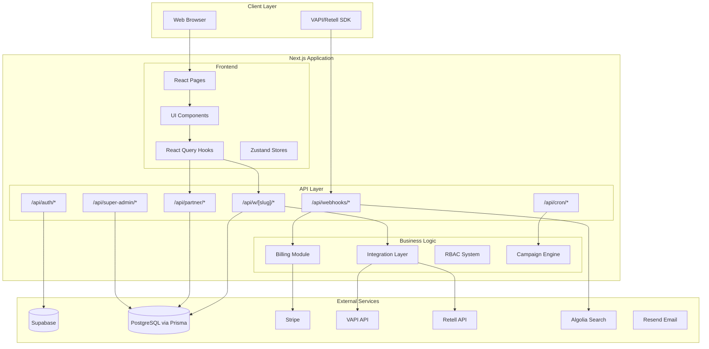
```mermaid
flowchart TB
    subgraph "Client Layer"
        Browser[Web Browser]
        SDK[VAPI/Retell SDK]
    end
    
    subgraph "Next.js Application"
        subgraph "Frontend"
            Pages[React Pages]
            Components[UI Components]
            Hooks[React Query Hooks]
            Stores[Zustand Stores]
        end
        
        subgraph "API Layer"
            AuthAPI["/api/auth/*"]
            WorkspaceAPI["/api/w/[slug]/*"]
            PartnerAPI["/api/partner/*"]
            SuperAdminAPI["/api/super-admin/*"]
            WebhooksAPI["/api/webhooks/*"]
            CronAPI["/api/cron/*"]
        end
        
        subgraph "Business Logic"
            Integrations[Integration Layer]
            Billing[Billing Module]
            RBAC[RBAC System]
            Campaigns[Campaign Engine]
        end
    end
    
    subgraph "External Services"
        Supabase[(Supabase)]
        Prisma[(PostgreSQL via Prisma)]
        Stripe[Stripe]
        VAPI[VAPI API]
        Retell[Retell API]
        Algolia[Algolia Search]
        Resend[Resend Email]
    end
    
    Browser --> Pages
    Pages --> Components
    Components --> Hooks
    Hooks --> WorkspaceAPI
    Hooks --> PartnerAPI
    
    SDK --> WebhooksAPI
    
    AuthAPI --> Supabase
    WorkspaceAPI --> Prisma
    WorkspaceAPI --> Integrations
    PartnerAPI --> Prisma
    SuperAdminAPI --> Prisma
    WebhooksAPI --> Billing
    WebhooksAPI --> Algolia
    
    Integrations --> VAPI
    Integrations --> Retell
    Billing --> Stripe
    CronAPI --> Campaigns
```

---

## 2. Multi-Tenancy Hierarchy

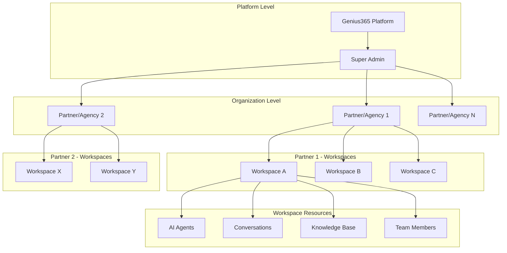
```mermaid
flowchart TB
    subgraph "Platform Level"
        Platform[Genius365 Platform]
        SuperAdmin[Super Admin]
    end
    
    subgraph "Organization Level"
        Partner1[Partner/Agency 1]
        Partner2[Partner/Agency 2]
        Partner3[Partner/Agency N]
    end
    
    subgraph "Partner 1 - Workspaces"
        WS1A[Workspace A]
        WS1B[Workspace B]
        WS1C[Workspace C]
    end
    
    subgraph "Partner 2 - Workspaces"
        WS2A[Workspace X]
        WS2B[Workspace Y]
    end
    
    subgraph "Workspace Resources"
        Agents[AI Agents]
        Calls[Conversations]
        KB[Knowledge Base]
        Members[Team Members]
    end
    
    Platform --> SuperAdmin
    SuperAdmin --> Partner1
    SuperAdmin --> Partner2
    SuperAdmin --> Partner3
    
    Partner1 --> WS1A
    Partner1 --> WS1B
    Partner1 --> WS1C
    
    Partner2 --> WS2A
    Partner2 --> WS2B
    
    WS1A --> Agents
    WS1A --> Calls
    WS1A --> KB
    WS1A --> Members
```

### Entity Relationship Diagram

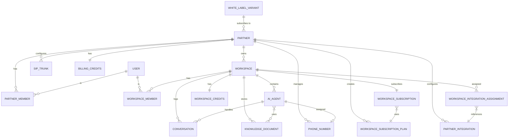
```mermaid
erDiagram
    WHITE_LABEL_VARIANT ||--o{ PARTNER : "subscribes to"
    PARTNER ||--o{ WORKSPACE : "owns"
    PARTNER ||--o{ PARTNER_MEMBER : "has"
    PARTNER ||--o{ PARTNER_INTEGRATION : "configures"
    PARTNER ||--o{ PHONE_NUMBER : "manages"
    PARTNER ||--o{ SIP_TRUNK : "configures"
    PARTNER ||--|| BILLING_CREDITS : "has"
    PARTNER ||--o{ WORKSPACE_SUBSCRIPTION_PLAN : "creates"
    
    USER ||--o{ PARTNER_MEMBER : "is"
    USER ||--o{ WORKSPACE_MEMBER : "is"
    
    WORKSPACE ||--o{ WORKSPACE_MEMBER : "has"
    WORKSPACE ||--o{ AI_AGENT : "contains"
    WORKSPACE ||--o{ CONVERSATION : "logs"
    WORKSPACE ||--o{ KNOWLEDGE_DOCUMENT : "stores"
    WORKSPACE ||--|| WORKSPACE_CREDITS : "has"
    WORKSPACE ||--|| WORKSPACE_SUBSCRIPTION : "subscribes"
    WORKSPACE ||--o{ WORKSPACE_INTEGRATION_ASSIGNMENT : "assigned"
    
    AI_AGENT ||--o{ CONVERSATION : "handles"
    AI_AGENT }|--o{ KNOWLEDGE_DOCUMENT : "uses"
    AI_AGENT ||--o| PHONE_NUMBER : "assigned"
    
    WORKSPACE_SUBSCRIPTION }|--|| WORKSPACE_SUBSCRIPTION_PLAN : "uses"
    WORKSPACE_INTEGRATION_ASSIGNMENT }|--|| PARTNER_INTEGRATION : "references"
```

---

## 3. Authentication Flow

### Login Flow

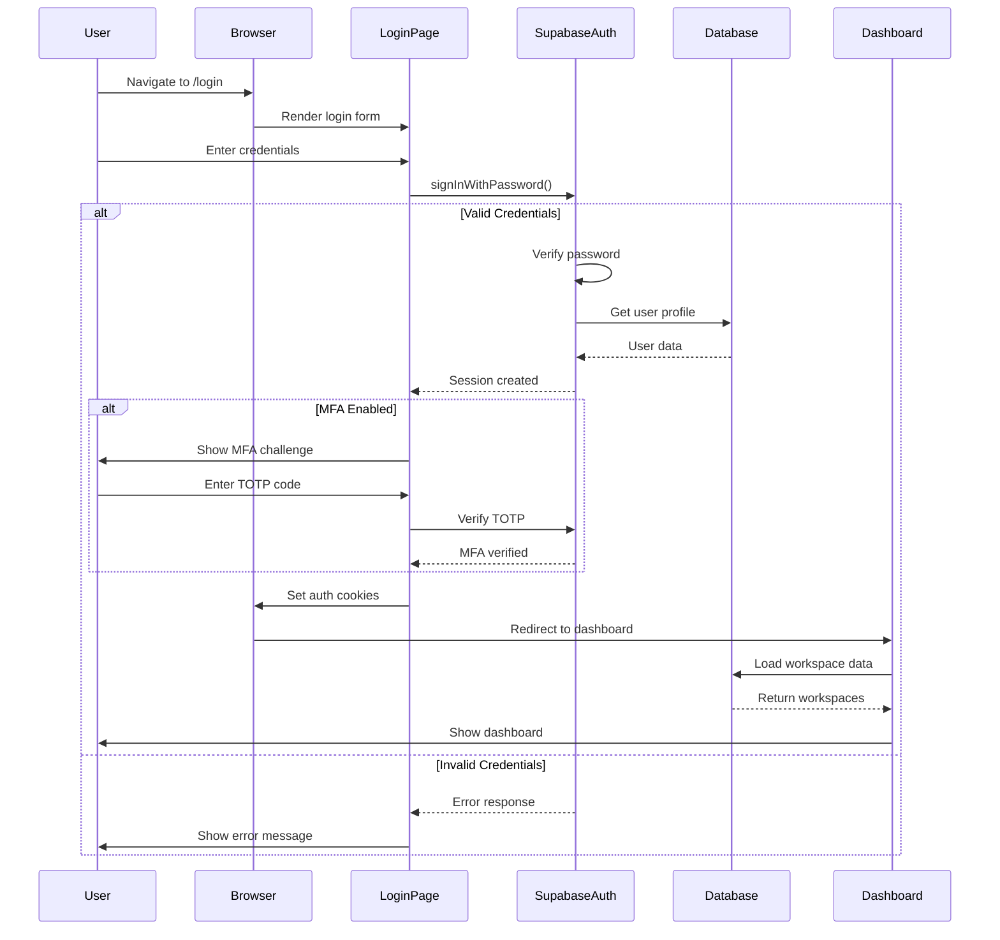
```mermaid
sequenceDiagram
    participant User
    participant Browser
    participant LoginPage
    participant SupabaseAuth
    participant Database
    participant Dashboard
    
    User->>Browser: Navigate to /login
    Browser->>LoginPage: Render login form
    User->>LoginPage: Enter credentials
    LoginPage->>SupabaseAuth: signInWithPassword()
    
    alt Valid Credentials
        SupabaseAuth->>SupabaseAuth: Verify password
        SupabaseAuth->>Database: Get user profile
        Database-->>SupabaseAuth: User data
        SupabaseAuth-->>LoginPage: Session created
        
        alt MFA Enabled
            LoginPage->>User: Show MFA challenge
            User->>LoginPage: Enter TOTP code
            LoginPage->>SupabaseAuth: Verify TOTP
            SupabaseAuth-->>LoginPage: MFA verified
        end
        
        LoginPage->>Browser: Set auth cookies
        Browser->>Dashboard: Redirect to dashboard
        Dashboard->>Database: Load workspace data
        Database-->>Dashboard: Return workspaces
        Dashboard->>User: Show dashboard
    else Invalid Credentials
        SupabaseAuth-->>LoginPage: Error response
        LoginPage->>User: Show error message
    end
```

### Signup Flow

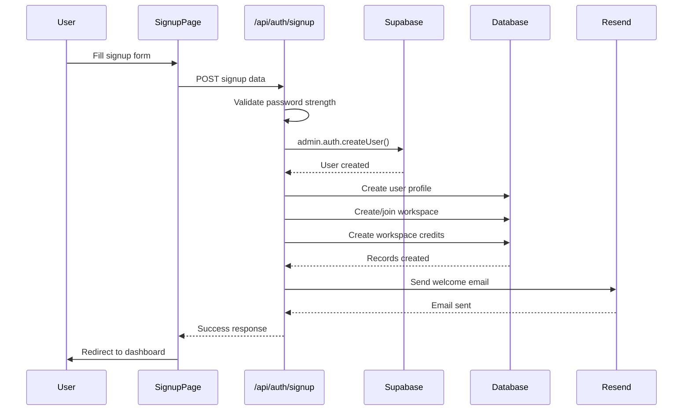
```mermaid
sequenceDiagram
    participant User
    participant SignupPage
    participant API as /api/auth/signup
    participant Supabase
    participant Database
    participant Email as Resend
    
    User->>SignupPage: Fill signup form
    SignupPage->>API: POST signup data
    
    API->>API: Validate password strength
    API->>Supabase: admin.auth.createUser()
    Supabase-->>API: User created
    
    API->>Database: Create user profile
    API->>Database: Create/join workspace
    API->>Database: Create workspace credits
    Database-->>API: Records created
    
    API->>Email: Send welcome email
    Email-->>API: Email sent
    
    API-->>SignupPage: Success response
    SignupPage->>User: Redirect to dashboard
```

### Session Management

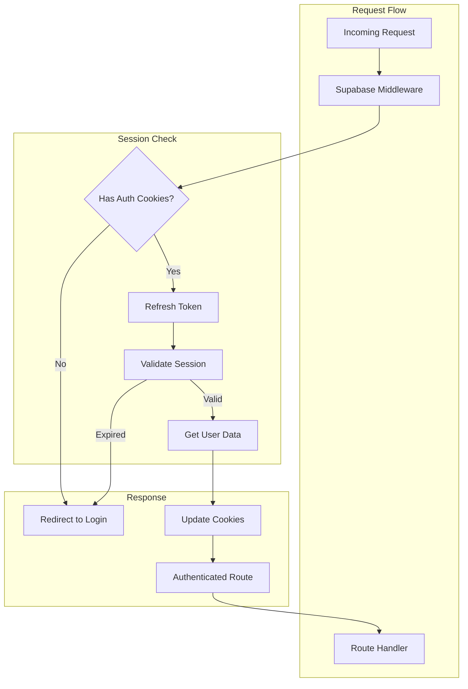
```mermaid
flowchart TB
    subgraph "Request Flow"
        Request[Incoming Request]
        Middleware[Supabase Middleware]
        RouteHandler[Route Handler]
    end
    
    subgraph "Session Check"
        CheckCookies{Has Auth Cookies?}
        RefreshToken[Refresh Token]
        ValidateSession[Validate Session]
        GetUser[Get User Data]
    end
    
    subgraph "Response"
        Authenticated[Authenticated Route]
        RedirectLogin[Redirect to Login]
        UpdateCookies[Update Cookies]
    end
    
    Request --> Middleware
    Middleware --> CheckCookies
    
    CheckCookies -->|Yes| RefreshToken
    CheckCookies -->|No| RedirectLogin
    
    RefreshToken --> ValidateSession
    ValidateSession -->|Valid| GetUser
    ValidateSession -->|Expired| RedirectLogin
    
    GetUser --> UpdateCookies
    UpdateCookies --> Authenticated
    Authenticated --> RouteHandler
```

---

## 4. Route Structure & Navigation

### Application Routes

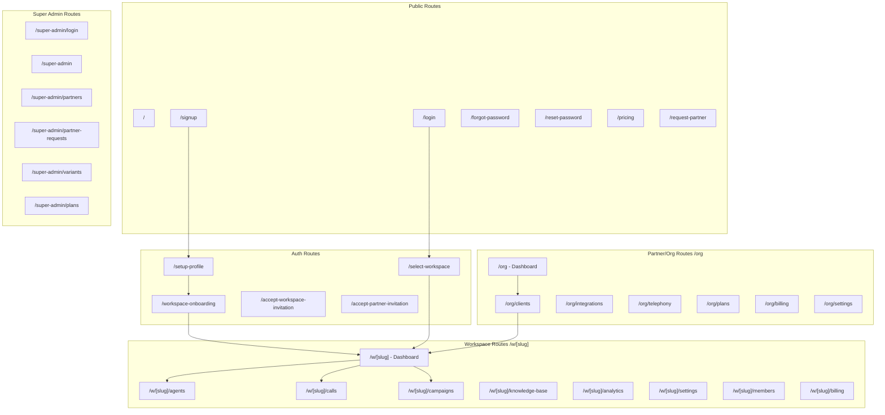
```mermaid
flowchart TB
    subgraph "Public Routes"
        Home["/"]
        Login["/login"]
        Signup["/signup"]
        ForgotPwd["/forgot-password"]
        ResetPwd["/reset-password"]
        Pricing["/pricing"]
        RequestPartner["/request-partner"]
    end
    
    subgraph "Auth Routes"
        SelectWS["/select-workspace"]
        SetupProfile["/setup-profile"]
        OnboardWS["/workspace-onboarding"]
        AcceptInvite["/accept-workspace-invitation"]
        AcceptPartner["/accept-partner-invitation"]
    end
    
    subgraph "Workspace Routes /w/[slug]"
        WSDash["/w/[slug] - Dashboard"]
        WSAgents["/w/[slug]/agents"]
        WSCalls["/w/[slug]/calls"]
        WSCampaigns["/w/[slug]/campaigns"]
        WSKnowledge["/w/[slug]/knowledge-base"]
        WSAnalytics["/w/[slug]/analytics"]
        WSSettings["/w/[slug]/settings"]
        WSMembers["/w/[slug]/members"]
        WSBilling["/w/[slug]/billing"]
    end
    
    subgraph "Partner/Org Routes /org"
        OrgDash["/org - Dashboard"]
        OrgClients["/org/clients"]
        OrgIntegrations["/org/integrations"]
        OrgTelephony["/org/telephony"]
        OrgPlans["/org/plans"]
        OrgBilling["/org/billing"]
        OrgSettings["/org/settings"]
    end
    
    subgraph "Super Admin Routes"
        SALogin["/super-admin/login"]
        SADash["/super-admin"]
        SAPartners["/super-admin/partners"]
        SARequests["/super-admin/partner-requests"]
        SAVariants["/super-admin/variants"]
        SAPlans["/super-admin/plans"]
    end
    
    Login --> SelectWS
    Signup --> SetupProfile
    SetupProfile --> OnboardWS
    OnboardWS --> WSDash
    
    SelectWS --> WSDash
    WSDash --> WSAgents
    WSDash --> WSCalls
    WSDash --> WSCampaigns
    
    OrgDash --> OrgClients
    OrgClients --> WSDash
```

### Navigation Flow

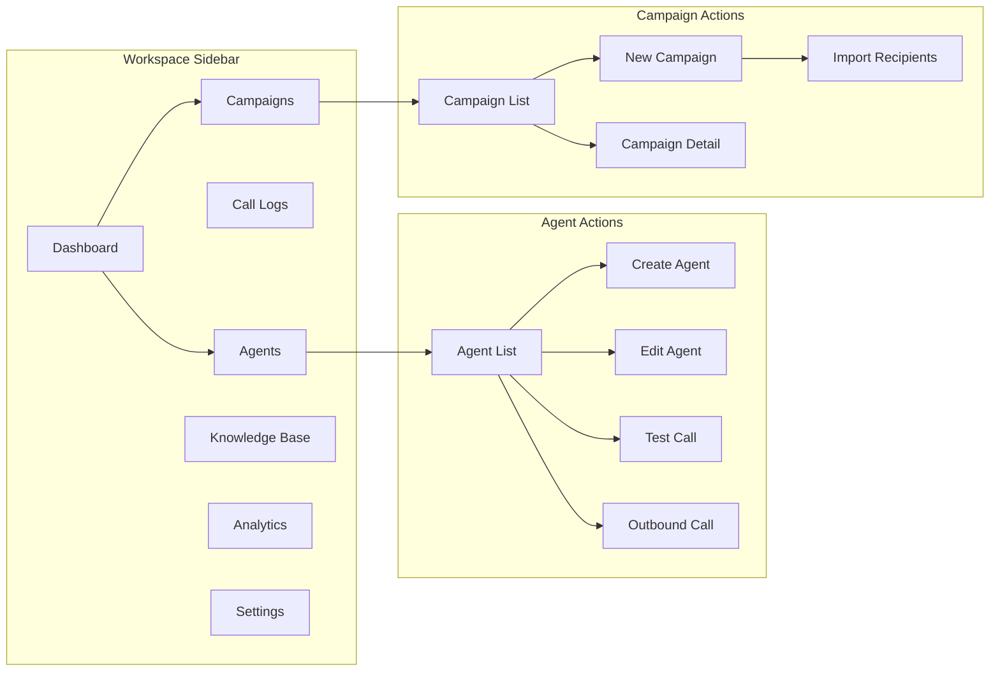
```mermaid
flowchart LR
    subgraph "Workspace Sidebar"
        Dashboard[Dashboard]
        Agents[Agents]
        Calls[Call Logs]
        Campaigns[Campaigns]
        Knowledge[Knowledge Base]
        Analytics[Analytics]
        Settings[Settings]
    end
    
    subgraph "Agent Actions"
        AgentList[Agent List]
        CreateAgent[Create Agent]
        EditAgent[Edit Agent]
        TestCall[Test Call]
        OutboundCall[Outbound Call]
    end
    
    subgraph "Campaign Actions"
        CampaignList[Campaign List]
        NewCampaign[New Campaign]
        CampaignDetail[Campaign Detail]
        ImportCSV[Import Recipients]
    end
    
    Dashboard --> Agents
    Agents --> AgentList
    AgentList --> CreateAgent
    AgentList --> EditAgent
    AgentList --> TestCall
    AgentList --> OutboundCall
    
    Dashboard --> Campaigns
    Campaigns --> CampaignList
    CampaignList --> NewCampaign
    CampaignList --> CampaignDetail
    NewCampaign --> ImportCSV
```

---

## 5. Voice Agent Lifecycle

### Agent Creation Flow

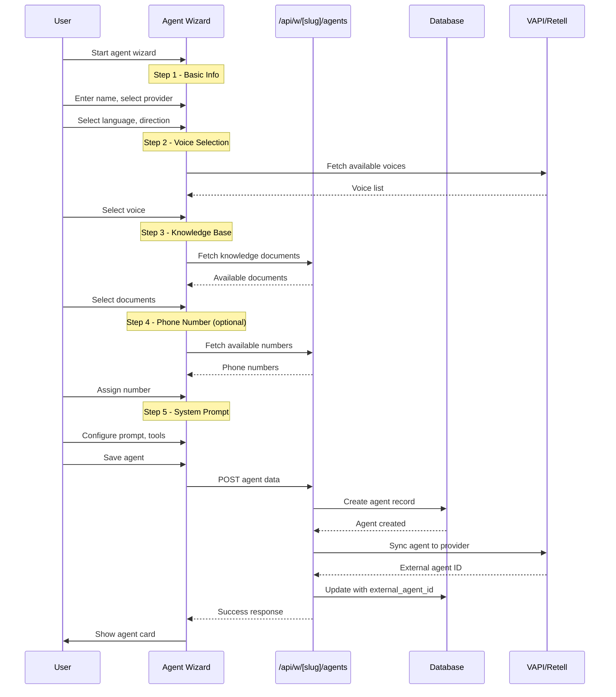
```mermaid
sequenceDiagram
    participant User
    participant Wizard as Agent Wizard
    participant API as /api/w/[slug]/agents
    participant DB as Database
    participant Provider as VAPI/Retell
    
    User->>Wizard: Start agent wizard
    
    Note over Wizard: Step 1 - Basic Info
    User->>Wizard: Enter name, select provider
    User->>Wizard: Select language, direction
    
    Note over Wizard: Step 2 - Voice Selection
    Wizard->>Provider: Fetch available voices
    Provider-->>Wizard: Voice list
    User->>Wizard: Select voice
    
    Note over Wizard: Step 3 - Knowledge Base
    Wizard->>API: Fetch knowledge documents
    API-->>Wizard: Available documents
    User->>Wizard: Select documents
    
    Note over Wizard: Step 4 - Phone Number (optional)
    Wizard->>API: Fetch available numbers
    API-->>Wizard: Phone numbers
    User->>Wizard: Assign number
    
    Note over Wizard: Step 5 - System Prompt
    User->>Wizard: Configure prompt, tools
    
    User->>Wizard: Save agent
    Wizard->>API: POST agent data
    
    API->>DB: Create agent record
    DB-->>API: Agent created
    
    API->>Provider: Sync agent to provider
    Provider-->>API: External agent ID
    
    API->>DB: Update with external_agent_id
    API-->>Wizard: Success response
    
    Wizard->>User: Show agent card
```

### Agent Sync to Provider

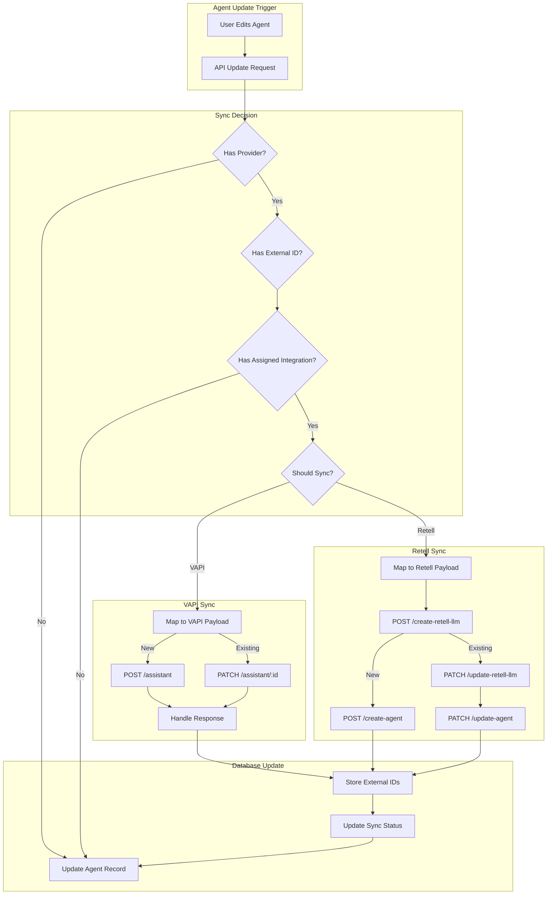
```mermaid
flowchart TB
    subgraph "Agent Update Trigger"
        UserEdit[User Edits Agent]
        APICall[API Update Request]
    end
    
    subgraph "Sync Decision"
        CheckProvider{Has Provider?}
        CheckExternal{Has External ID?}
        CheckAssigned{Has Assigned Integration?}
        ShouldSync{Should Sync?}
    end
    
    subgraph "VAPI Sync"
        MapToVAPI[Map to VAPI Payload]
        VAPICreate[POST /assistant]
        VAPIUpdate[PATCH /assistant/:id]
        HandleVAPIResponse[Handle Response]
    end
    
    subgraph "Retell Sync"
        MapToRetell[Map to Retell Payload]
        CreateLLM[POST /create-retell-llm]
        UpdateLLM[PATCH /update-retell-llm]
        CreateAgent[POST /create-agent]
        UpdateAgent[PATCH /update-agent]
    end
    
    subgraph "Database Update"
        UpdateDB[Update Agent Record]
        StoreExternalID[Store External IDs]
        UpdateSyncStatus[Update Sync Status]
    end
    
    UserEdit --> APICall
    APICall --> CheckProvider
    
    CheckProvider -->|No| UpdateDB
    CheckProvider -->|Yes| CheckExternal
    
    CheckExternal --> CheckAssigned
    CheckAssigned -->|No| UpdateDB
    CheckAssigned -->|Yes| ShouldSync
    
    ShouldSync -->|VAPI| MapToVAPI
    ShouldSync -->|Retell| MapToRetell
    
    MapToVAPI -->|New| VAPICreate
    MapToVAPI -->|Existing| VAPIUpdate
    VAPICreate --> HandleVAPIResponse
    VAPIUpdate --> HandleVAPIResponse
    HandleVAPIResponse --> StoreExternalID
    
    MapToRetell --> CreateLLM
    CreateLLM -->|New| CreateAgent
    CreateLLM -->|Existing| UpdateLLM
    CreateAgent --> StoreExternalID
    UpdateLLM --> UpdateAgent
    UpdateAgent --> StoreExternalID
    
    StoreExternalID --> UpdateSyncStatus
    UpdateSyncStatus --> UpdateDB
```

---

## 6. Provider Integration Flow

### Integration Assignment Flow

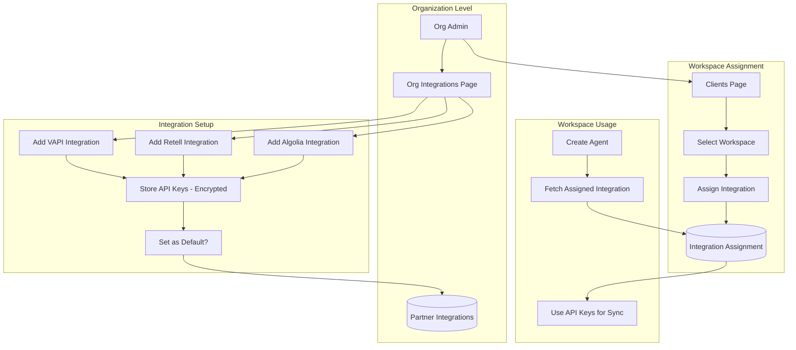
```mermaid
flowchart TB
    subgraph "Organization Level"
        OrgAdmin[Org Admin]
        OrgIntegrations[Org Integrations Page]
        PartnerIntegration[(Partner Integrations)]
    end
    
    subgraph "Integration Setup"
        AddVAPI[Add VAPI Integration]
        AddRetell[Add Retell Integration]
        AddAlgolia[Add Algolia Integration]
        StoreKeys[Store API Keys - Encrypted]
        SetDefault[Set as Default?]
    end
    
    subgraph "Workspace Assignment"
        ClientsPage[Clients Page]
        SelectWorkspace[Select Workspace]
        AssignIntegration[Assign Integration]
        CreateAssignment[(Integration Assignment)]
    end
    
    subgraph "Workspace Usage"
        WorkspaceAgent[Create Agent]
        FetchIntegration[Fetch Assigned Integration]
        UseAPIKeys[Use API Keys for Sync]
    end
    
    OrgAdmin --> OrgIntegrations
    OrgIntegrations --> AddVAPI
    OrgIntegrations --> AddRetell
    OrgIntegrations --> AddAlgolia
    
    AddVAPI --> StoreKeys
    AddRetell --> StoreKeys
    AddAlgolia --> StoreKeys
    StoreKeys --> SetDefault
    SetDefault --> PartnerIntegration
    
    OrgAdmin --> ClientsPage
    ClientsPage --> SelectWorkspace
    SelectWorkspace --> AssignIntegration
    AssignIntegration --> CreateAssignment
    
    WorkspaceAgent --> FetchIntegration
    FetchIntegration --> CreateAssignment
    CreateAssignment --> UseAPIKeys
```

### API Key Resolution Flow

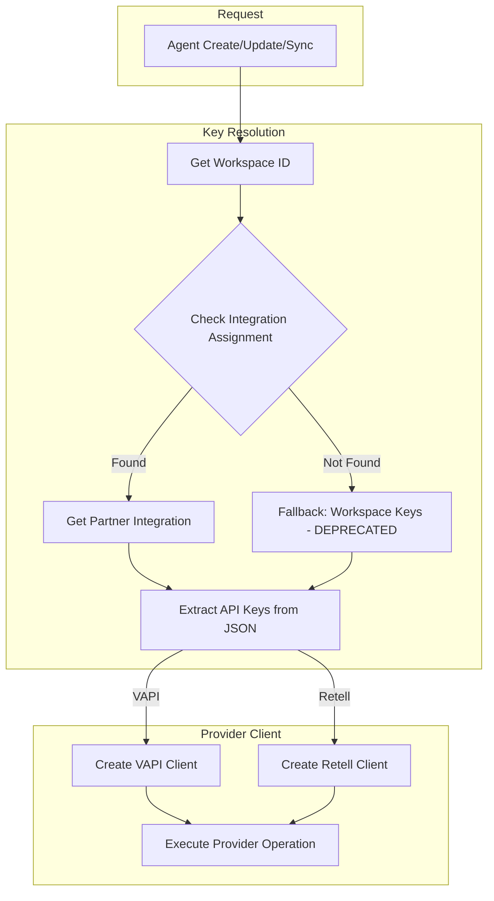
```mermaid
flowchart TB
    subgraph "Request"
        AgentOperation[Agent Create/Update/Sync]
    end
    
    subgraph "Key Resolution"
        GetWorkspaceId[Get Workspace ID]
        CheckAssignment{Check Integration Assignment}
        GetPartnerIntegration[Get Partner Integration]
        FallbackWorkspaceKeys[Fallback: Workspace Keys - DEPRECATED]
        ExtractAPIKeys[Extract API Keys from JSON]
    end
    
    subgraph "Provider Client"
        CreateVAPIClient[Create VAPI Client]
        CreateRetellClient[Create Retell Client]
        ExecuteOperation[Execute Provider Operation]
    end
    
    AgentOperation --> GetWorkspaceId
    GetWorkspaceId --> CheckAssignment
    
    CheckAssignment -->|Found| GetPartnerIntegration
    CheckAssignment -->|Not Found| FallbackWorkspaceKeys
    
    GetPartnerIntegration --> ExtractAPIKeys
    FallbackWorkspaceKeys --> ExtractAPIKeys
    
    ExtractAPIKeys -->|VAPI| CreateVAPIClient
    ExtractAPIKeys -->|Retell| CreateRetellClient
    
    CreateVAPIClient --> ExecuteOperation
    CreateRetellClient --> ExecuteOperation
```

---

## 7. Webhook Processing Flow

### VAPI Webhook Flow

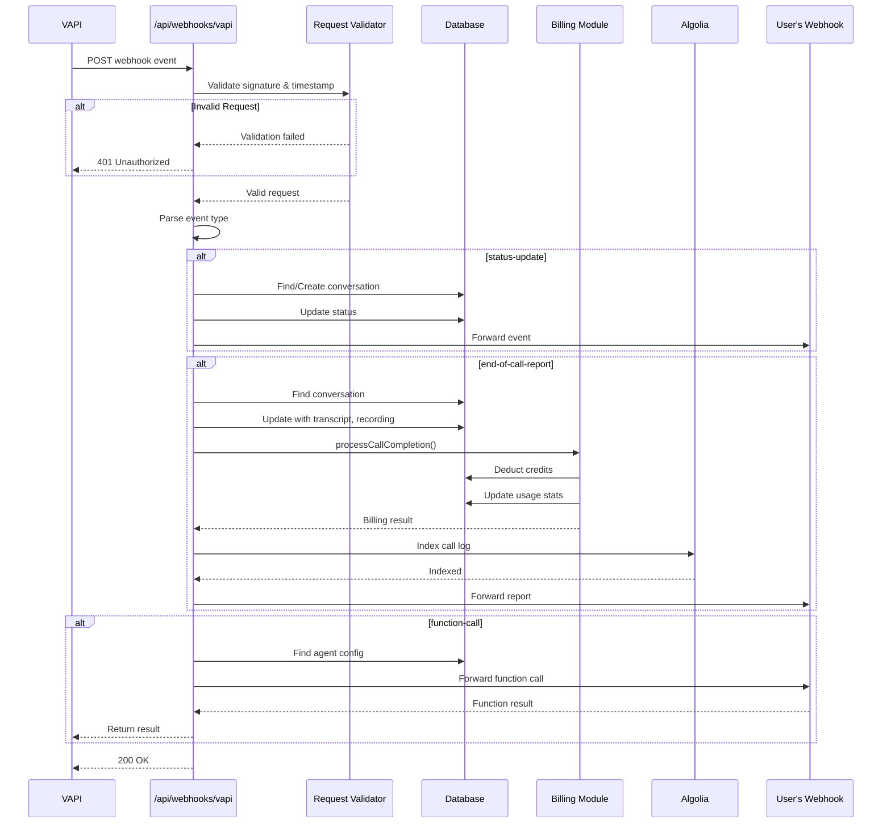
```mermaid
sequenceDiagram
    participant VAPI
    participant Webhook as /api/webhooks/vapi
    participant Validator as Request Validator
    participant DB as Database
    participant Billing as Billing Module
    participant Algolia
    participant UserWebhook as User's Webhook
    
    VAPI->>Webhook: POST webhook event
    Webhook->>Validator: Validate signature & timestamp
    
    alt Invalid Request
        Validator-->>Webhook: Validation failed
        Webhook-->>VAPI: 401 Unauthorized
    end
    
    Validator-->>Webhook: Valid request
    Webhook->>Webhook: Parse event type
    
    alt status-update
        Webhook->>DB: Find/Create conversation
        Webhook->>DB: Update status
        Webhook->>UserWebhook: Forward event
    end
    
    alt end-of-call-report
        Webhook->>DB: Find conversation
        Webhook->>DB: Update with transcript, recording
        
        Webhook->>Billing: processCallCompletion()
        Billing->>DB: Deduct credits
        Billing->>DB: Update usage stats
        Billing-->>Webhook: Billing result
        
        Webhook->>Algolia: Index call log
        Algolia-->>Webhook: Indexed
        
        Webhook->>UserWebhook: Forward report
    end
    
    alt function-call
        Webhook->>DB: Find agent config
        Webhook->>UserWebhook: Forward function call
        UserWebhook-->>Webhook: Function result
        Webhook-->>VAPI: Return result
    end
    
    Webhook-->>VAPI: 200 OK
```

### Retell Webhook Flow

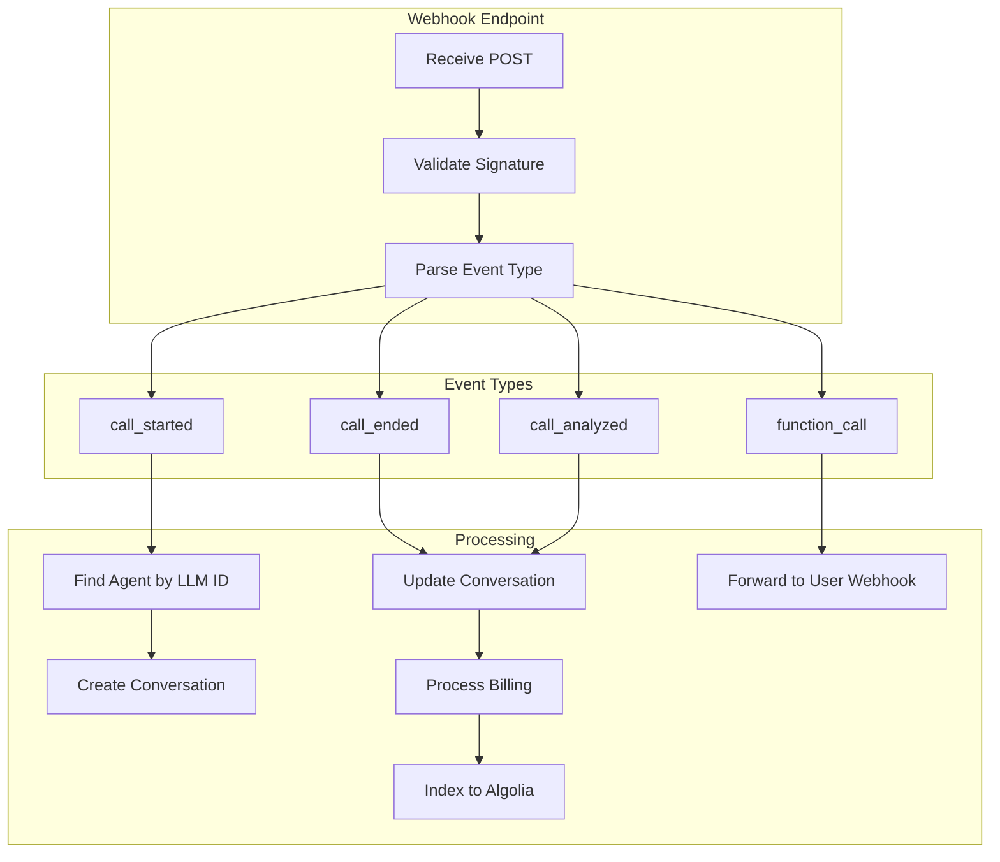
```mermaid
flowchart TB
    subgraph "Webhook Endpoint"
        Receive[Receive POST]
        ValidateSignature[Validate Signature]
        ParseEvent[Parse Event Type]
    end
    
    subgraph "Event Types"
        CallStarted[call_started]
        CallEnded[call_ended]
        CallAnalyzed[call_analyzed]
        FunctionCall[function_call]
    end
    
    subgraph "Processing"
        FindAgent[Find Agent by LLM ID]
        CreateConversation[Create Conversation]
        UpdateConversation[Update Conversation]
        ProcessBilling[Process Billing]
        IndexAlgolia[Index to Algolia]
        ForwardToUser[Forward to User Webhook]
    end
    
    Receive --> ValidateSignature
    ValidateSignature --> ParseEvent
    
    ParseEvent --> CallStarted
    ParseEvent --> CallEnded
    ParseEvent --> CallAnalyzed
    ParseEvent --> FunctionCall
    
    CallStarted --> FindAgent
    FindAgent --> CreateConversation
    
    CallEnded --> UpdateConversation
    UpdateConversation --> ProcessBilling
    ProcessBilling --> IndexAlgolia
    
    CallAnalyzed --> UpdateConversation
    
    FunctionCall --> ForwardToUser
```

---

## 8. Billing & Credits System

### Credit-Based Billing Flow

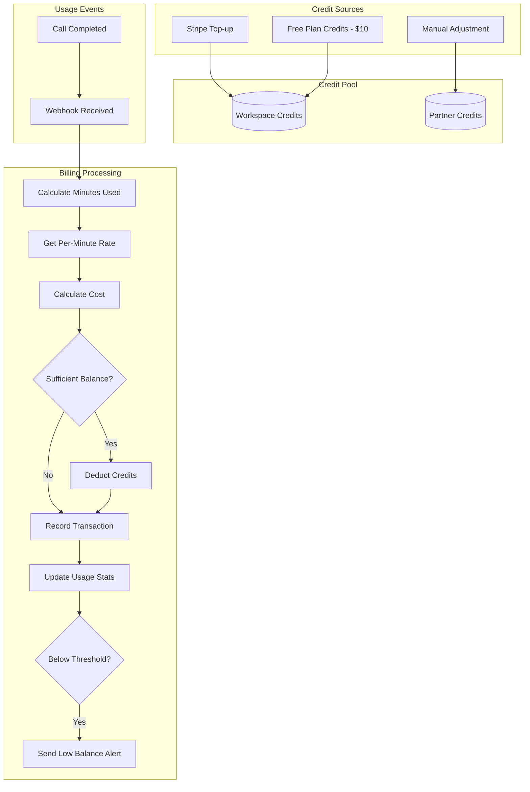
```mermaid
flowchart TB
    subgraph "Credit Sources"
        StripeTopup[Stripe Top-up]
        FreeCredits[Free Plan Credits - $10]
        Manual[Manual Adjustment]
    end
    
    subgraph "Credit Pool"
        WorkspaceCredits[(Workspace Credits)]
        PartnerCredits[(Partner Credits)]
    end
    
    subgraph "Usage Events"
        CallComplete[Call Completed]
        WebhookReceived[Webhook Received]
    end
    
    subgraph "Billing Processing"
        CalculateMinutes[Calculate Minutes Used]
        GetRate[Get Per-Minute Rate]
        CalculateCost[Calculate Cost]
        CheckBalance{Sufficient Balance?}
        DeductCredits[Deduct Credits]
        RecordTransaction[Record Transaction]
        UpdateUsageStats[Update Usage Stats]
        LowBalanceCheck{Below Threshold?}
        SendAlert[Send Low Balance Alert]
    end
    
    StripeTopup --> WorkspaceCredits
    FreeCredits --> WorkspaceCredits
    Manual --> PartnerCredits
    
    CallComplete --> WebhookReceived
    WebhookReceived --> CalculateMinutes
    CalculateMinutes --> GetRate
    GetRate --> CalculateCost
    CalculateCost --> CheckBalance
    
    CheckBalance -->|Yes| DeductCredits
    CheckBalance -->|No| RecordTransaction
    
    DeductCredits --> RecordTransaction
    RecordTransaction --> UpdateUsageStats
    UpdateUsageStats --> LowBalanceCheck
    LowBalanceCheck -->|Yes| SendAlert
```

### Subscription Plan Flow

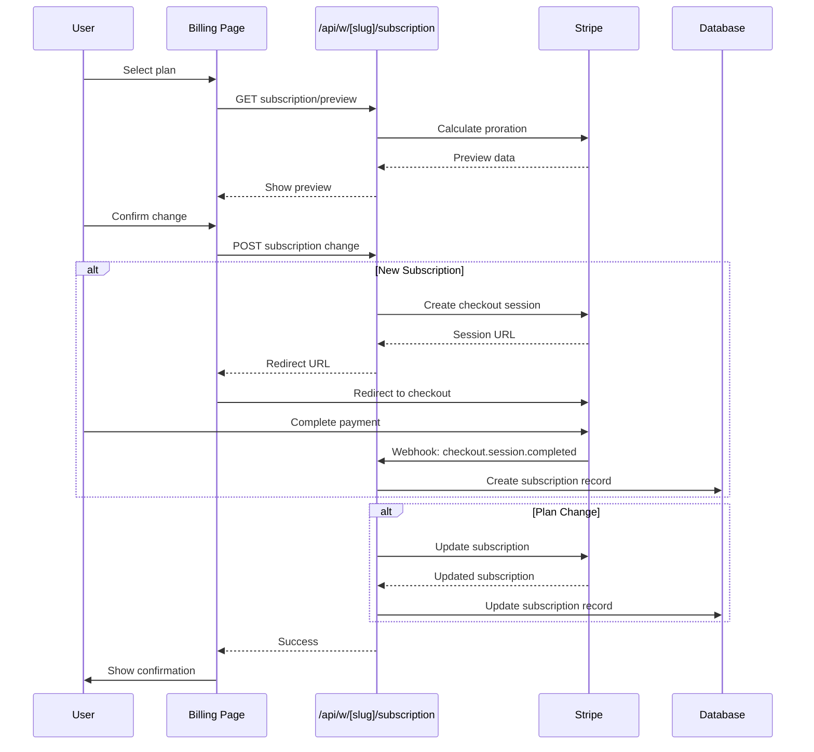
```mermaid
sequenceDiagram
    participant User
    participant UI as Billing Page
    participant API as /api/w/[slug]/subscription
    participant Stripe
    participant DB as Database
    
    User->>UI: Select plan
    UI->>API: GET subscription/preview
    API->>Stripe: Calculate proration
    Stripe-->>API: Preview data
    API-->>UI: Show preview
    
    User->>UI: Confirm change
    UI->>API: POST subscription change
    
    alt New Subscription
        API->>Stripe: Create checkout session
        Stripe-->>API: Session URL
        API-->>UI: Redirect URL
        UI->>Stripe: Redirect to checkout
        User->>Stripe: Complete payment
        Stripe->>API: Webhook: checkout.session.completed
        API->>DB: Create subscription record
    end
    
    alt Plan Change
        API->>Stripe: Update subscription
        Stripe-->>API: Updated subscription
        API->>DB: Update subscription record
    end
    
    API-->>UI: Success
    UI->>User: Show confirmation
```

### Postpaid Billing Flow

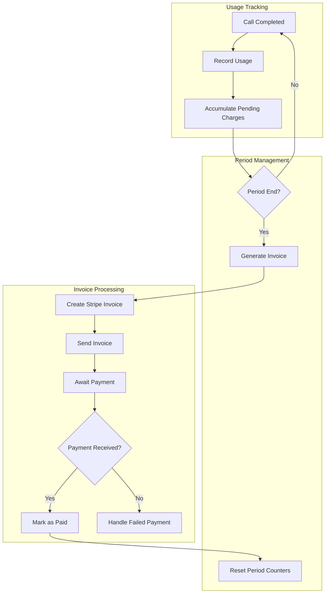
```mermaid
flowchart TB
    subgraph "Usage Tracking"
        CallComplete[Call Completed]
        RecordUsage[Record Usage]
        AccumulateCharges[Accumulate Pending Charges]
    end
    
    subgraph "Period Management"
        CheckPeriodEnd{Period End?}
        GenerateInvoice[Generate Invoice]
        ResetCounters[Reset Period Counters]
    end
    
    subgraph "Invoice Processing"
        CreateStripeInvoice[Create Stripe Invoice]
        SendInvoice[Send Invoice]
        AwaitPayment[Await Payment]
        PaymentReceived{Payment Received?}
        MarkPaid[Mark as Paid]
        HandleFailed[Handle Failed Payment]
    end
    
    CallComplete --> RecordUsage
    RecordUsage --> AccumulateCharges
    AccumulateCharges --> CheckPeriodEnd
    
    CheckPeriodEnd -->|No| CallComplete
    CheckPeriodEnd -->|Yes| GenerateInvoice
    
    GenerateInvoice --> CreateStripeInvoice
    CreateStripeInvoice --> SendInvoice
    SendInvoice --> AwaitPayment
    AwaitPayment --> PaymentReceived
    
    PaymentReceived -->|Yes| MarkPaid
    PaymentReceived -->|No| HandleFailed
    
    MarkPaid --> ResetCounters
```

---

## 9. Batch Campaign Flow

### Campaign Creation Flow

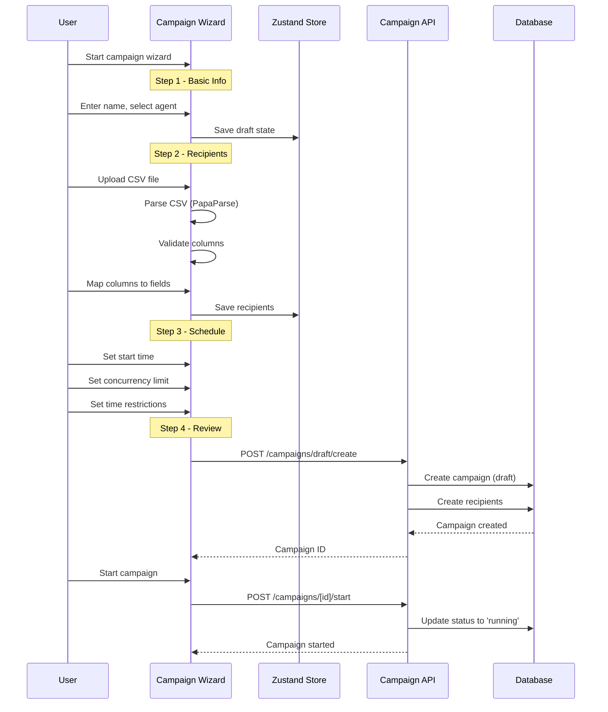
```mermaid
sequenceDiagram
    participant User
    participant Wizard as Campaign Wizard
    participant Store as Zustand Store
    participant API as Campaign API
    participant DB as Database
    
    User->>Wizard: Start campaign wizard
    
    Note over Wizard: Step 1 - Basic Info
    User->>Wizard: Enter name, select agent
    Wizard->>Store: Save draft state
    
    Note over Wizard: Step 2 - Recipients
    User->>Wizard: Upload CSV file
    Wizard->>Wizard: Parse CSV (PapaParse)
    Wizard->>Wizard: Validate columns
    User->>Wizard: Map columns to fields
    Wizard->>Store: Save recipients
    
    Note over Wizard: Step 3 - Schedule
    User->>Wizard: Set start time
    User->>Wizard: Set concurrency limit
    User->>Wizard: Set time restrictions
    
    Note over Wizard: Step 4 - Review
    Wizard->>API: POST /campaigns/draft/create
    API->>DB: Create campaign (draft)
    API->>DB: Create recipients
    DB-->>API: Campaign created
    API-->>Wizard: Campaign ID
    
    User->>Wizard: Start campaign
    Wizard->>API: POST /campaigns/[id]/start
    API->>DB: Update status to 'running'
    API-->>Wizard: Campaign started
```

### Campaign Execution Flow

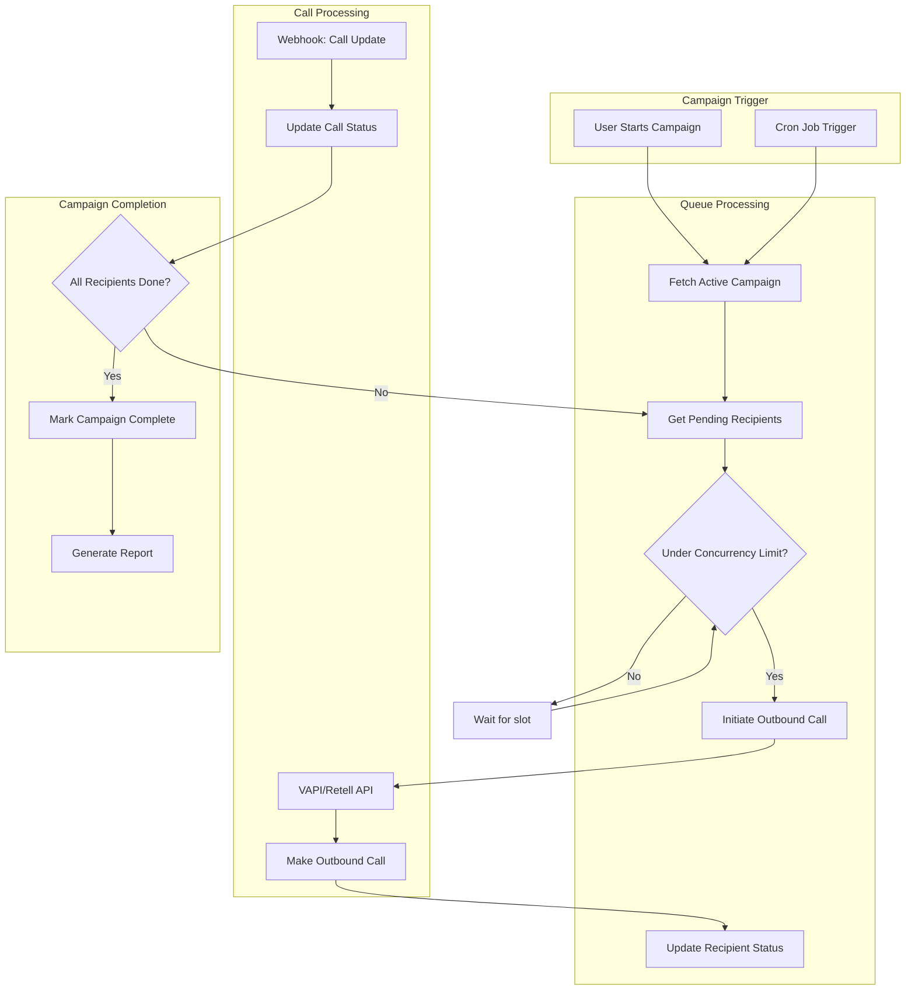
```mermaid
flowchart TB
    subgraph "Campaign Trigger"
        UserStart[User Starts Campaign]
        CronTrigger[Cron Job Trigger]
    end
    
    subgraph "Queue Processing"
        FetchCampaign[Fetch Active Campaign]
        GetPendingRecipients[Get Pending Recipients]
        CheckConcurrency{Under Concurrency Limit?}
        InitiateCall[Initiate Outbound Call]
        UpdateRecipientStatus[Update Recipient Status]
    end
    
    subgraph "Call Processing"
        ProviderAPI[VAPI/Retell API]
        MakeCall[Make Outbound Call]
        WebhookReceived[Webhook: Call Update]
        UpdateCallStatus[Update Call Status]
    end
    
    subgraph "Campaign Completion"
        CheckAllComplete{All Recipients Done?}
        MarkComplete[Mark Campaign Complete]
        GenerateReport[Generate Report]
    end
    
    UserStart --> FetchCampaign
    CronTrigger --> FetchCampaign
    
    FetchCampaign --> GetPendingRecipients
    GetPendingRecipients --> CheckConcurrency
    
    CheckConcurrency -->|Yes| InitiateCall
    CheckConcurrency -->|No| Wait[Wait for slot]
    Wait --> CheckConcurrency
    
    InitiateCall --> ProviderAPI
    ProviderAPI --> MakeCall
    MakeCall --> UpdateRecipientStatus
    
    WebhookReceived --> UpdateCallStatus
    UpdateCallStatus --> CheckAllComplete
    
    CheckAllComplete -->|No| GetPendingRecipients
    CheckAllComplete -->|Yes| MarkComplete
    MarkComplete --> GenerateReport
```

### Realtime Campaign Monitoring

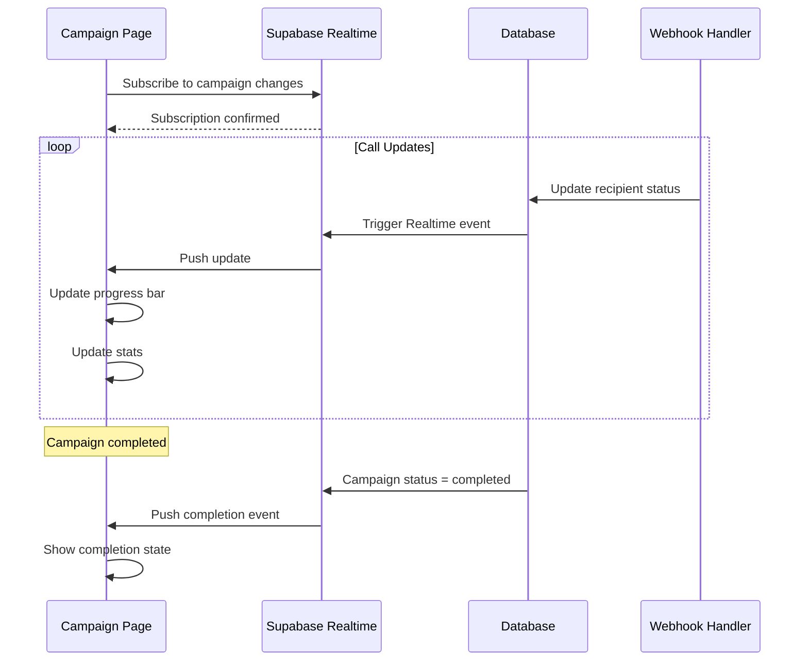
```mermaid
sequenceDiagram
    participant UI as Campaign Page
    participant Supabase as Supabase Realtime
    participant DB as Database
    participant Webhook as Webhook Handler
    
    UI->>Supabase: Subscribe to campaign changes
    Supabase-->>UI: Subscription confirmed
    
    loop Call Updates
        Webhook->>DB: Update recipient status
        DB->>Supabase: Trigger Realtime event
        Supabase->>UI: Push update
        UI->>UI: Update progress bar
        UI->>UI: Update stats
    end
    
    Note over UI: Campaign completed
    DB->>Supabase: Campaign status = completed
    Supabase->>UI: Push completion event
    UI->>UI: Show completion state
```

---

## 10. Call Logs & Search Flow

### Call Log Display Flow

```mermaid
flowchart TB
    subgraph "User Interface"
        CallsPage[Calls Page]
        SearchInput[Search Input]
        Filters[Status/Direction/Date Filters]
        Results[Results Table]
    end
    
    subgraph "Search Decision"
        CheckAlgolia{Algolia Configured?}
        AlgoliaSearch[Algolia Search]
        DBSearch[Database Search]
    end
    
    subgraph "Algolia Search Path"
        BuildAlgoliaQuery[Build Algolia Query]
        AddWorkspaceFilter[Add workspace_id Filter]
        ExecuteAlgoliaSearch[Execute Search]
        GetConversationIds[Get Conversation IDs]
        FetchFromDB[Fetch Full Records from DB]
    end
    
    subgraph "Database Search Path"
        BuildDBQuery[Build SQL Query]
        TextSearch[ILIKE Search on Fields]
        ApplyFilters[Apply Status/Date Filters]
        ExecuteDBQuery[Execute Query]
    end
    
    CallsPage --> SearchInput
    SearchInput --> Filters
    Filters --> CheckAlgolia
    
    CheckAlgolia -->|Yes| AlgoliaSearch
    CheckAlgolia -->|No| DBSearch
    
    AlgoliaSearch --> BuildAlgoliaQuery
    BuildAlgoliaQuery --> AddWorkspaceFilter
    AddWorkspaceFilter --> ExecuteAlgoliaSearch
    ExecuteAlgoliaSearch --> GetConversationIds
    GetConversationIds --> FetchFromDB
    FetchFromDB --> Results
    
    DBSearch --> BuildDBQuery
    BuildDBQuery --> TextSearch
    TextSearch --> ApplyFilters
    ApplyFilters --> ExecuteDBQuery
    ExecuteDBQuery --> Results
```

### Algolia Indexing Flow

```mermaid
sequenceDiagram
    participant Webhook as Webhook Handler
    participant DB as Database
    participant Algolia
    participant Index as Call Logs Index
    
    Note over Webhook: Call completed (end-of-call-report)
    
    Webhook->>DB: Update conversation
    Webhook->>DB: Process billing
    
    Webhook->>Algolia: Check workspace config
    Algolia-->>Webhook: Algolia credentials found
    
    Webhook->>Index: Configure index settings
    Note over Index: Set searchable attributes
    Note over Index: Set facets (workspace_id)
    Note over Index: Set ranking
    
    Webhook->>Webhook: Build CallLogAlgoliaRecord
    Note over Webhook: objectID, workspace_id,<br/>transcript, summary,<br/>agent_name, sentiment
    
    Webhook->>Index: PUT /indexes/call-logs/:objectID
    Index-->>Webhook: Indexed successfully
    
    Note over Webhook: Record searchable in ~1s
```

### Call Log Record Structure

```mermaid
flowchart LR
    subgraph "Algolia Record"
        ObjectID[objectID: conversation.id]
        WorkspaceID[workspace_id - filterOnly]
        Direction[direction - facet]
        Status[status - facet]
        Sentiment[sentiment - facet]
        Provider[provider - facet]
        Transcript[transcript - searchable]
        Summary[summary - searchable]
        AgentName[agent_name - searchable]
        CallerName[caller_name - searchable]
        PhoneNumber[phone_number - searchable]
        Duration[duration_seconds]
        Cost[total_cost]
        CreatedAt[created_at_timestamp]
    end
```

---

## 11. White-Label Partner Flow

### Partner Request & Provisioning

```mermaid
sequenceDiagram
    participant Applicant
    participant RequestForm as Request Form
    participant API as /api/partner-requests
    participant SuperAdmin
    participant AdminAPI as /api/super-admin
    participant Provision as Provision Service
    participant DB as Database
    participant Email as Resend
    
    Applicant->>RequestForm: Fill application
    Note over RequestForm: Company info,<br/>subdomain,<br/>custom domain,<br/>branding
    
    RequestForm->>API: POST partner request
    API->>DB: Create request (pending)
    API->>Email: Notify super admin
    API-->>RequestForm: Request submitted
    
    SuperAdmin->>AdminAPI: Review request
    AdminAPI->>DB: Get request details
    
    alt Approve
        SuperAdmin->>AdminAPI: Assign variant, approve
        AdminAPI->>DB: Update status: approved
        AdminAPI->>Provision: Provision partner
        
        Provision->>DB: Create Partner record
        Provision->>DB: Create PartnerDomain
        Provision->>DB: Create default Workspace
        Provision->>DB: Create PartnerMember (owner)
        Provision->>DB: Create BillingCredits
        
        Provision->>Email: Send approval email
        Email-->>Applicant: Welcome email + login link
    end
    
    alt Reject
        SuperAdmin->>AdminAPI: Reject with reason
        AdminAPI->>DB: Update status: rejected
        AdminAPI->>Email: Send rejection email
    end
```

### Partner Branding Flow

```mermaid
flowchart TB
    subgraph "Partner Configuration"
        PartnerSettings[Partner Settings]
        BrandingConfig[Branding Configuration]
        UploadLogo[Upload Logo]
        SetColors[Set Brand Colors]
        CustomDomain[Configure Custom Domain]
    end
    
    subgraph "Database Storage"
        PartnerRecord[(Partner Record)]
        DomainRecord[(Partner Domain)]
    end
    
    subgraph "Runtime Resolution"
        Request[Incoming Request]
        ExtractHostname[Extract Hostname]
        ResolveDomain[Resolve Partner by Domain]
        LoadBranding[Load Branding Config]
        ApplyCSS[Apply CSS Variables]
        RenderUI[Render Branded UI]
    end
    
    PartnerSettings --> BrandingConfig
    BrandingConfig --> UploadLogo
    BrandingConfig --> SetColors
    BrandingConfig --> CustomDomain
    
    UploadLogo --> PartnerRecord
    SetColors --> PartnerRecord
    CustomDomain --> DomainRecord
    
    Request --> ExtractHostname
    ExtractHostname --> ResolveDomain
    ResolveDomain --> DomainRecord
    DomainRecord --> LoadBranding
    LoadBranding --> PartnerRecord
    PartnerRecord --> ApplyCSS
    ApplyCSS --> RenderUI
```

### White-Label Variant Management

```mermaid
flowchart TB
    subgraph "Super Admin"
        CreateVariant[Create White-Label Variant]
        SetPricing[Set Monthly Price]
        SetLimits[Set Workspace Limits]
        CreateStripeProduct[Create Stripe Product]
    end
    
    subgraph "Variant Options"
        Starter[Starter Variant<br/>5 workspaces - $99/mo]
        Growth[Growth Variant<br/>15 workspaces - $299/mo]
        Enterprise[Enterprise Variant<br/>Unlimited - $999/mo]
    end
    
    subgraph "Partner Assignment"
        PartnerRequest[Partner Request]
        SelectVariant[Assign Variant]
        ProvisionPartner[Provision Partner]
        EnforceLimits[Enforce Limits]
    end
    
    CreateVariant --> SetPricing
    SetPricing --> SetLimits
    SetLimits --> CreateStripeProduct
    
    CreateStripeProduct --> Starter
    CreateStripeProduct --> Growth
    CreateStripeProduct --> Enterprise
    
    PartnerRequest --> SelectVariant
    SelectVariant --> Starter
    SelectVariant --> Growth
    SelectVariant --> Enterprise
    
    Starter --> ProvisionPartner
    Growth --> ProvisionPartner
    Enterprise --> ProvisionPartner
    
    ProvisionPartner --> EnforceLimits
```

---

## 12. Knowledge Base Integration

### Knowledge Document Flow

```mermaid
sequenceDiagram
    participant User
    participant UI as Knowledge Base Page
    participant API as /api/w/[slug]/knowledge-base
    participant Storage as Supabase Storage
    participant DB as Database
    
    User->>UI: Add document
    
    alt Text Content
        User->>UI: Enter title, content
        UI->>API: POST document
        API->>DB: Create KnowledgeDocument
        DB-->>API: Document created
        API-->>UI: Success
    end
    
    alt File Upload
        User->>UI: Upload file
        UI->>Storage: Upload to bucket
        Storage-->>UI: File URL
        UI->>API: POST document with file URL
        API->>DB: Create KnowledgeDocument
        DB-->>API: Document created
        API-->>UI: Success
    end
    
    Note over UI: Document available for agents
```

### Agent Knowledge Integration

```mermaid
flowchart TB
    subgraph "Agent Creation"
        AgentWizard[Agent Wizard]
        SelectDocs[Select Knowledge Documents]
        SaveAgent[Save Agent]
    end
    
    subgraph "Database"
        Agent[(AI Agent)]
        KnowledgeDoc[(Knowledge Document)]
        Junction[(Agent Knowledge Documents)]
    end
    
    subgraph "Sync to Provider"
        FetchDocs[Fetch Selected Documents]
        FormatContent[Format Document Content]
        AppendToPrompt[Append to System Prompt]
        SyncToVAPI[Sync to VAPI/Retell]
    end
    
    subgraph "Call Execution"
        IncomingCall[Incoming Call]
        LoadSystemPrompt[Load System Prompt]
        IncludeKnowledge[Include Knowledge Content]
        AgentResponse[Agent Uses Knowledge]
    end
    
    AgentWizard --> SelectDocs
    SelectDocs --> SaveAgent
    SaveAgent --> Agent
    SaveAgent --> Junction
    Junction --> KnowledgeDoc
    
    SaveAgent --> FetchDocs
    FetchDocs --> FormatContent
    FormatContent --> AppendToPrompt
    AppendToPrompt --> SyncToVAPI
    
    IncomingCall --> LoadSystemPrompt
    LoadSystemPrompt --> IncludeKnowledge
    IncludeKnowledge --> AgentResponse
```

---

## 13. Phone Number Management

### Phone Number Lifecycle

```mermaid
flowchart TB
    subgraph "Organization Level"
        OrgTelephony[Org Telephony Page]
        AddSIPTrunk[Add SIP Trunk]
        ImportNumbers[Import Phone Numbers]
    end
    
    subgraph "SIP Configuration"
        ConfigureSIP[Configure SIP Server]
        SetCredentials[Set Authentication]
        TestConnection[Test Connection]
        SyncToProvider[Sync to VAPI/Retell]
    end
    
    subgraph "Phone Number Pool"
        AvailableNumbers[(Available Numbers)]
        AssignedNumbers[(Assigned Numbers)]
    end
    
    subgraph "Workspace Assignment"
        SelectWorkspace[Select Workspace]
        SelectNumber[Select Phone Number]
        AssignToAgent[Assign to Agent]
        BindToProvider[Bind in Provider]
    end
    
    OrgTelephony --> AddSIPTrunk
    AddSIPTrunk --> ConfigureSIP
    ConfigureSIP --> SetCredentials
    SetCredentials --> TestConnection
    TestConnection --> SyncToProvider
    
    OrgTelephony --> ImportNumbers
    ImportNumbers --> AvailableNumbers
    
    AvailableNumbers --> SelectNumber
    SelectWorkspace --> SelectNumber
    SelectNumber --> AssignToAgent
    AssignToAgent --> AssignedNumbers
    AssignedNumbers --> BindToProvider
```

### Provider Phone Binding

```mermaid
sequenceDiagram
    participant Admin
    participant API as Agent API
    participant DB as Database
    participant Provider as VAPI/Retell
    
    Admin->>API: Assign phone to agent
    API->>DB: Update agent.assignedPhoneNumberId
    
    API->>Provider: Sync agent with phone
    
    alt VAPI
        Provider->>Provider: POST /phone-number/buy (or import)
        Provider->>Provider: PATCH /phone-number/:id
        Note over Provider: Set assistantId = agent.externalAgentId
    end
    
    alt Retell
        Provider->>Provider: POST /import-phone-number
        Provider->>Provider: PATCH /update-phone-number
        Note over Provider: Set agent_id = agent.externalAgentId
    end
    
    Provider-->>API: Phone bound to agent
    API->>DB: Update sync status
    API-->>Admin: Success
    
    Note over Admin: Inbound calls to this number<br/>now route to this agent
```

---

## 14. Role-Based Access Control

### Permission Hierarchy

```mermaid
flowchart TB
    subgraph "Super Admin"
        SARole[Super Admin Role]
        SAAllAccess[Full Platform Access]
    end
    
    subgraph "Partner Roles"
        PartnerOwner[Partner Owner]
        PartnerAdmin[Partner Admin]
        PartnerMember[Partner Member]
    end
    
    subgraph "Partner Permissions"
        ManageWorkspaces[manage:workspaces]
        ManageIntegrations[manage:integrations]
        ManageTeam[manage:team]
        ManageBilling[manage:billing]
        ViewDashboard[view:dashboard]
    end
    
    subgraph "Workspace Roles"
        WSOwner[Workspace Owner]
        WSAdmin[Workspace Admin]
        WSMember[Workspace Member]
        WSViewer[Workspace Viewer]
    end
    
    subgraph "Workspace Permissions"
        ManageAgents[manage:agents]
        ManageCampaigns[manage:campaigns]
        ManageKnowledge[manage:knowledge]
        ViewCalls[view:calls]
        ViewAnalytics[view:analytics]
    end
    
    SARole --> SAAllAccess
    
    PartnerOwner --> ManageWorkspaces
    PartnerOwner --> ManageIntegrations
    PartnerOwner --> ManageTeam
    PartnerOwner --> ManageBilling
    
    PartnerAdmin --> ManageWorkspaces
    PartnerAdmin --> ManageIntegrations
    PartnerAdmin --> ViewDashboard
    
    PartnerMember --> ViewDashboard
    
    WSOwner --> ManageAgents
    WSOwner --> ManageCampaigns
    WSOwner --> ManageKnowledge
    WSOwner --> ViewCalls
    
    WSAdmin --> ManageAgents
    WSAdmin --> ManageCampaigns
    WSAdmin --> ViewCalls
    
    WSMember --> ViewCalls
    WSMember --> ViewAnalytics
    
    WSViewer --> ViewCalls
```

### Permission Check Flow

```mermaid
flowchart TB
    subgraph "API Request"
        IncomingRequest[API Request]
        ExtractAuth[Extract Auth Token]
        GetUser[Get User from Supabase]
    end
    
    subgraph "Context Resolution"
        GetPartnerMembership[Get Partner Membership]
        GetWorkspaceMemberships[Get Workspace Memberships]
        ResolveRole[Resolve Role for Resource]
    end
    
    subgraph "Permission Check"
        RequiredPermission[Required Permission]
        HasPermission{Has Permission?}
        AllowAccess[Allow Access]
        DenyAccess[403 Forbidden]
    end
    
    IncomingRequest --> ExtractAuth
    ExtractAuth --> GetUser
    GetUser --> GetPartnerMembership
    GetUser --> GetWorkspaceMemberships
    
    GetPartnerMembership --> ResolveRole
    GetWorkspaceMemberships --> ResolveRole
    
    ResolveRole --> RequiredPermission
    RequiredPermission --> HasPermission
    
    HasPermission -->|Yes| AllowAccess
    HasPermission -->|No| DenyAccess
```

---

## 15. Data Flow Architecture

### Complete Request-Response Cycle

```mermaid
flowchart TB
    subgraph "Client"
        Browser[Browser]
        ReactQuery[React Query]
        ZustandStore[Zustand Store]
    end
    
    subgraph "Next.js Server"
        PageServer[Page Server Component]
        APIRoute[API Route Handler]
        MiddlewareAuth[Auth Middleware]
    end
    
    subgraph "Data Layer"
        PrismaClient[Prisma Client]
        SupabaseClient[Supabase Client]
        PostgreSQL[(PostgreSQL)]
    end
    
    subgraph "External APIs"
        VAPI[VAPI API]
        Retell[Retell API]
        Stripe[Stripe API]
        Algolia[Algolia API]
    end
    
    Browser --> ReactQuery
    ReactQuery --> APIRoute
    APIRoute --> MiddlewareAuth
    MiddlewareAuth --> SupabaseClient
    SupabaseClient --> PostgreSQL
    
    APIRoute --> PrismaClient
    PrismaClient --> PostgreSQL
    
    APIRoute --> VAPI
    APIRoute --> Retell
    APIRoute --> Stripe
    APIRoute --> Algolia
    
    PageServer --> PrismaClient
    PageServer --> Browser
    
    ReactQuery --> ZustandStore
```

### Realtime Data Sync

```mermaid
sequenceDiagram
    participant UI as React UI
    participant Query as React Query
    participant Supabase as Supabase Realtime
    participant DB as PostgreSQL
    participant External as External Service
    
    UI->>Query: useWorkspaceCalls()
    Query->>DB: Fetch initial data
    DB-->>Query: Call logs
    Query-->>UI: Render table
    
    UI->>Supabase: Subscribe to conversations
    
    loop Realtime Updates
        External->>DB: Webhook updates conversation
        DB->>Supabase: Trigger change event
        Supabase->>UI: Push update
        UI->>Query: Invalidate query
        Query->>DB: Refetch
        DB-->>Query: Updated data
        Query-->>UI: Re-render
    end
```

### Error Handling Flow

```mermaid
flowchart TB
    subgraph "Error Sources"
        APIError[API Error]
        ValidationError[Validation Error]
        AuthError[Auth Error]
        NetworkError[Network Error]
    end
    
    subgraph "Error Handling"
        ErrorHandler[API Error Handler]
        FormatResponse[Format Error Response]
        LogError[Log to Console/Sentry]
    end
    
    subgraph "Client Response"
        ToastError[Show Toast Notification]
        FormError[Show Form Errors]
        RedirectLogin[Redirect to Login]
        RetryRequest[Retry with Backoff]
    end
    
    APIError --> ErrorHandler
    ValidationError --> ErrorHandler
    AuthError --> ErrorHandler
    NetworkError --> RetryRequest
    
    ErrorHandler --> FormatResponse
    ErrorHandler --> LogError
    
    FormatResponse -->|400| FormError
    FormatResponse -->|401| RedirectLogin
    FormatResponse -->|403| ToastError
    FormatResponse -->|500| ToastError
    
    RetryRequest -->|Max Retries| ToastError
```

---

## Summary

This document provides comprehensive flowcharts covering all major aspects of the Genius365 platform:

| Flow | Description |
|------|-------------|
| System Architecture | Overall tech stack and component relationships |
| Multi-Tenancy | Partner → Workspace → User hierarchy |
| Authentication | Login, signup, session management |
| Route Structure | Application navigation and pages |
| Voice Agent | Creation, configuration, provider sync |
| Integrations | VAPI/Retell key management and usage |
| Webhooks | Real-time call event processing |
| Billing | Credits, subscriptions, usage tracking |
| Campaigns | Batch calling with CSV import |
| Call Logs | Algolia search and display |
| White-Label | Partner provisioning and branding |
| Knowledge Base | Document management for agents |
| Phone Numbers | SIP trunks and number assignment |
| RBAC | Role-based permission system |
| Data Flow | Request/response and realtime sync |

---

*These flowcharts are rendered using Mermaid. View in any Mermaid-compatible markdown viewer or use the [Mermaid Live Editor](https://mermaid.live) for interactive viewing.*
